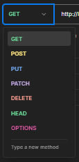
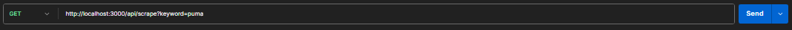
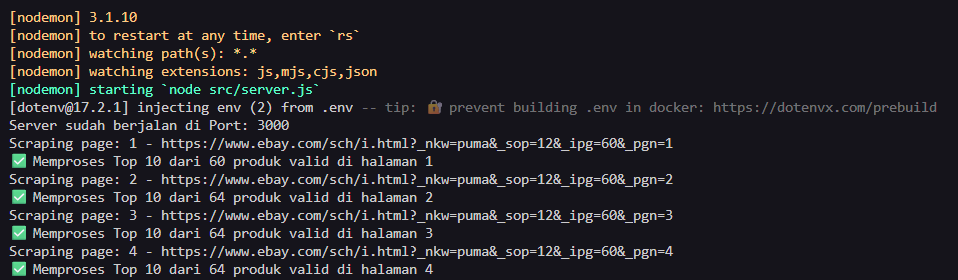
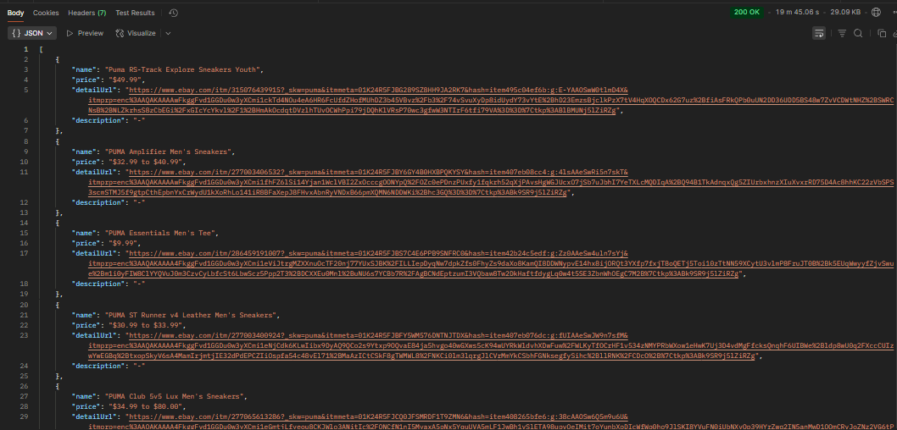

<h1 align="center">Coding Interview:<br/>Web Scraping API Development using AI</h1>

<h3 align="center">Create By: <br/>Rhisma Syahrul putra</h3>

**Introduction**

<p align="justify">In today&#39;s rapidly evolving technological landscape, AI plays a significant role in enhancing web scraping techniques. From solving complex scraping challenges to handling unstructured data and summarizing extracted content, AI tools such as ChatGPT or Deepseek can provide innovative solutions.</p>

**Task Description**

<p align="justify">Your challenge is to create an API to scrape product listings from an e-commerce page.</p>

**Requirements**

1. Core Requirements (Mandatory):
   - Use <b>Javascript</b>.
   - Use <b>AI</b> to get the data from the page.
   - Results must be returned in <b>JSON format</b>.
   - Make AI can extract at least the <b>product name, product price, and product description.</b>
     - You can visit each product&#39;s detail page and retrieve the <b>product description</b> provided by the seller inside the nested product detail page.
   - Scrape <b>all products</b> across pagination.
     If any field (e.g., product price or description) does not have a value, return &#39;-&#39;.

**My Tech Stack List**

1. JavaScript & Express
2. Axios
3. Cheerio
4. Puppeteer, Puppeteer-extra, Puppeteer-extra-plugin-stealth
5. Replicate
6. IBM Granite AI Model
7. Dotenv
8. Nodemon
9. ESLint & Prettier

<h2>HOW TO USE</h2>

### Cloning the Repository

To get a local copy of this project on your machine, follow these steps:

1.  **Open your terminal or command prompt.**

2.  **Navigate to the directory where you want to store the project.** For example:

    ```bash
    cd Documents/Projects
    ```

3.  **Clone the repository using the `git clone` command:**

    ```bash
    git clone <repository_url>
    ```

    Replace `<repository_url>` with the actual URL of the repository you want to clone. You can find this URL on the repository's page (usually a green "Code" button). It will look something like this:

    ```
    git clone https://github.com/RhismaSyahrulPutra/web-scraping-api
    ```

4.  **The repository will be downloaded to your local machine.** A new directory with the same name as the repository will be created in the directory you specified.

5.  **Navigate into the newly created directory:**

    ```bash
    cd web-scraping-api
    ```

You now have a local copy of the project and can start working on it!

### Local Project Setup

1.  **Install Dependencies:**

    Open your terminal, navigate to the `web-scraping-api` directory (or the root directory if the instructions are for the root), and run the following command to install all necessary dependencies:

    ```bash
    npm install
    ```

2.  **Configure Environment Variables:**

    Create a `.env` file in the root directory of the project (if it doesn't already exist). Add the following variables to the `.env` file, replacing the placeholders with the appropriate values for your backend setup:

    ```
    PORT=<your_backend_port>
    REPLICATE_API_TOKEN=<your_replicate_api_token>

    ```

    - `PORT`: The port number your backend server will listen on (e.g., 3000).
    - `REPLICATE_API_TOKEN`: Your API token for accessing the Replicate service.

3.  **Run the Development Server:**

    Start the development server using the following command:

    ```bash
    npm run dev
    ```

    This will typically start the application in your browser at a URL like `http://localhost:3000` (the exact URL will be displayed in your terminal output).

4.  **Code Formatting and Linting:**

    To ensure consistent code style and catch potential errors, use the following commands to format and lint your code after making changes:

    ```bash
    npm run format
    npm run lint
    ```

    These commands will automatically format your code according to the project's style guidelines and identify any linting issues. Make sure to address any linting errors before committing your changes.

### API Testing with Postman

1. **VPN Setup**  
   To ensure that the scraping/API process runs smoothly, it is recommended to use a VPN.  
   In this example, I’m using the free version of **Turbo VPN**.

   [Download Turbo VPN](https://turbovpn.com/id/download/windows)

2. **API Testing with Postman**
   - Make sure the backend server is running, and the terminal displays:

     ```bash
     Server sudah berjalan di Port: 3000
     ```

     _(This means your backend is up and ready to accept requests.)_

   - Open **Postman**.

> [!NOTE]
> If you don’t have Postman installed, you can download it here:  
> [Download Postman](https://www.postman.com/downloads/)

- Go to **Collections** and change the HTTP method to **GET**.  
  

- Enter your `localhost` URL:

  ```bash
  http://localhost:3000
  ```

- Add the route for the API endpoint:

  ```bash
  http://localhost:3000/api/scrape
  ```

- Add a query parameter for the keyword you want to scrape:
  ```bash
  http://localhost:3000/api/scrape?keyword=[product name]
  ```

3. **Send the Request**
   - Click the **Send** button in Postman.  
     
   - Wait for the scraping process to finish.  
     

> [!NOTE]  
> The scraping process will cover 5 pages, retrieving the top 10 items from each page.

4. **View the Results**
   - The scraping results will be displayed in the **Response** tab of Postman.  
     
